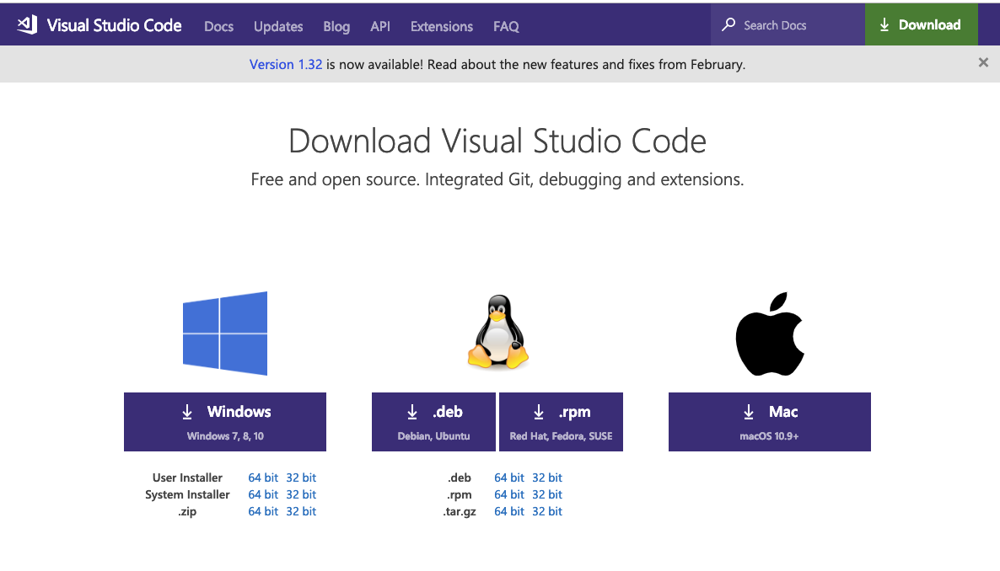

#### VSCode  설치하기

Visual Studio Code는 마이크로 소프트사에서 공개한 무료 에디터로, 최근 들어 개발자들 사이에서 굉장히 많이 사용되어 지고 있는 툴입니다. 

실습은 VSCode를 이용해서 진행하기 때문에 설치를 해야 합니다.
VSCode를 이용해서 Python을 실행할 것입니다.

1. VSCode공식 홈페이지(https://code.visualstudio.com/Download)에 가서 설치합니다.

2. 설치가 완료된 VSCode를 실행 시키고 shift+control(Command)+x 키를 누르거나 마우스로 플러그인 설치 메뉴를 누릅니다. 그리고 검색창에 python을 검색하고 플러그인을 설치합니다.

