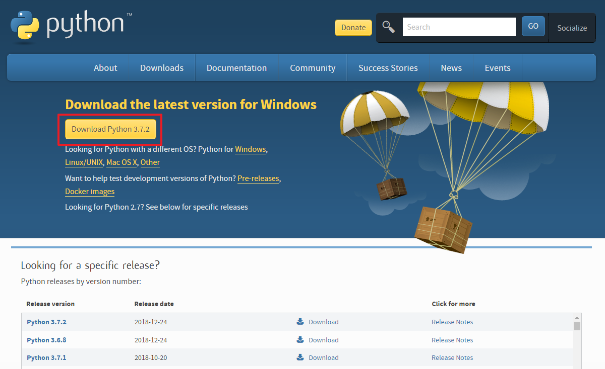
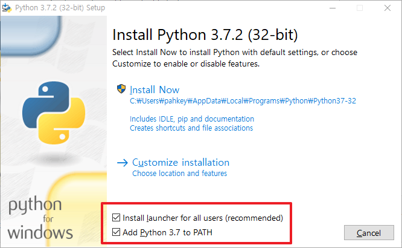

#### 파이썬 설치하기

1. 파이썬 공식 홈페이지([http://www.python.org/downloads](http://www.python.org/downloads/)) 에 접속해서 Python 3.7.2 를 설치합니다.

2. 다운 받은 파이썬 파일을 실행한 다음 "Install Now"를 선택하면 설치가 진행됩니다.

   ##### (설치 전 "Add Python 3.7 to PATH"를 체크 합니다.)

