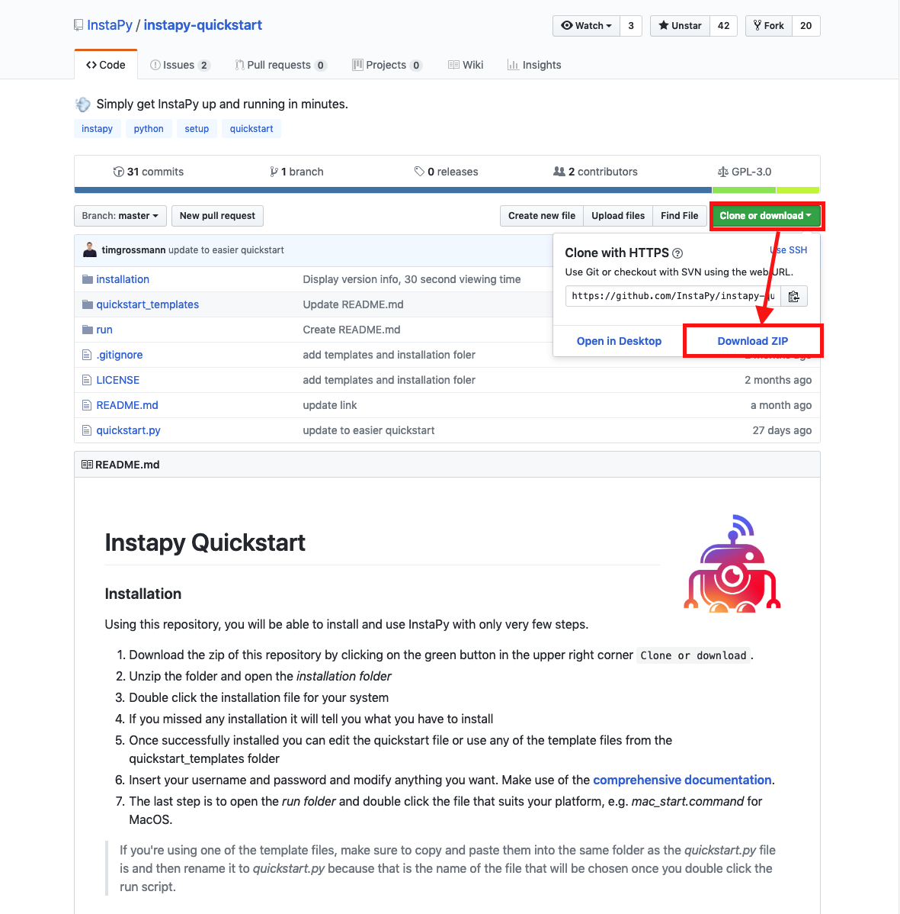
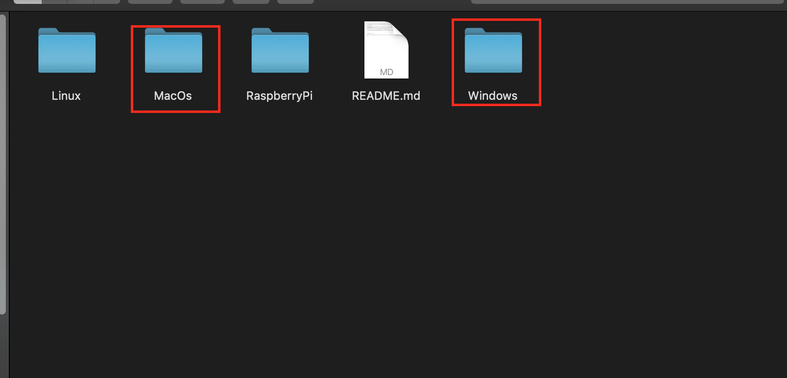

## 인스타파이 설치

1. https://github.com/InstaPy/instapy-quickstart 에 접속해서 오른쪽 상단에 초록색 버튼을 눌러 zip다운로드

2. 다운 받은 zip을 압축 해제 후 instapy-quickstart-master 폴더에 들어가서 한번 더 instapy-quickstart-master폴더로 들어간다.

3. installation폴더에 접속해서 본인의 운영체제(windows, mac)에 맞는 폴더로 들어가서 install 파일을 실행 시키는데, 이때 설치는 '**관리자권한**'으로 실행해서 설치 해야 한다.

 