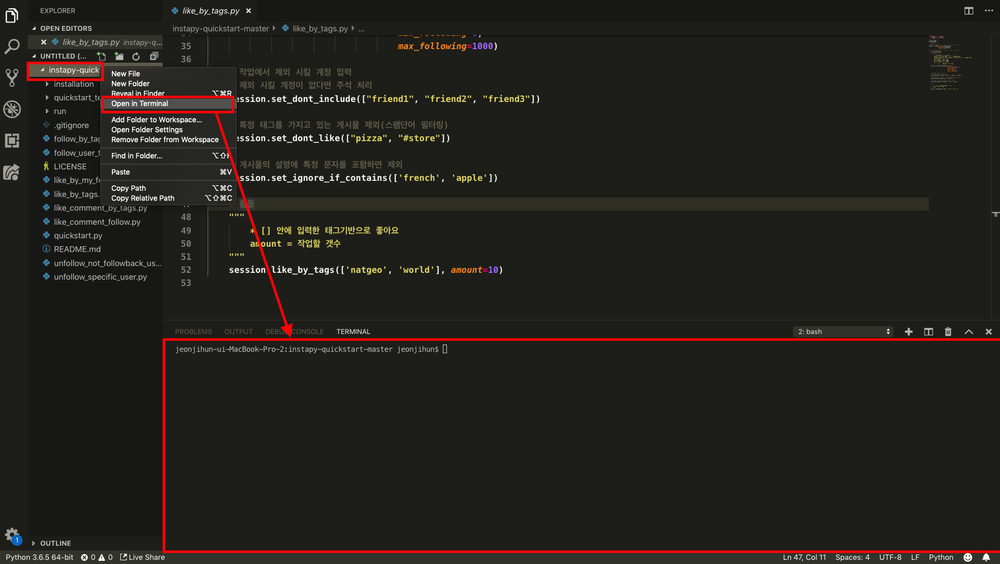

## 인스타 파이 템플릿

[인스타파이](https://github.com/timgrossmann/InstaPy) 라이브러리를 이용해서 인스타그램을 보다 쉽게 관리 할수 있습니다. 
더 자세한 설명과 관련 문서는 [인스타파이 설명](https://github.com/timgrossmann/InstaPy) 링크를 클릭하시면 보실수 있습니다.

수업시간에 다 설명하지 못한 내용과 추가적으로 드릴 기본 템플릿들 입니다. 아래 템플릿들만 이용하셔도 충분히 활용 할수 있습니다. 
하지만 좀 더 다양하게 쓰고 싶으시다면 위에 걸어드린 링크로 들어가셔서 사용방법에 대해서 공부해보시고 여러가지 옵션을 사용해 보시는것을 추천드립니다.

아래 템플릿들은 인스타파이를 다운로드 받고 설치 해놓은 instapy-quickstart-master 폴더 에다가 py확장자를 가지는 파일로 저장하셔야 합니다.


#### 템플릿 실행 방법

그 동안은 VSCode로 F5를 눌러서 실행을 시켰었습니다. 하지만 자동화를 시키려면 VSCode로 실행 시키는 것이 아니라 직접 파이썬을 이용해서 실행을 시켜야 합니다.

먼저 실습은 VSCode의 콘솔에서 진행해 보겠습니다.

1. VSCode를 키고 우리가 설치한 instapy-quickstart-master 폴더 를 열어 줍니다. 그리고 왼쪽 워크스페이스에서 열린 폴더에서 마우스 오른쪽 클릭을 하고 'Open in Teminal'을 눌러서 터미널을 엽니다.(파일을 불러 오면 터미널이 자동으로 열리나 안열리는 경우도 있으니 열어 줍니다.)

    

 

2. 이제 터미널에서 직접 파일을 실행 시켜 보겠습니다.

   

   위 사진과 같이 입력하고 엔터를 치면 like_by_tags.py가 실행 됩니다.

   ```
   python like_by_tags.py
   ```

   명령어를 설명 드리면 앞에 python 명령어는 현재 내 컴퓨터에 설치된 python 실행 프로그램입니다. 그리고 뒤에 like_by_tags.py는 내가 python으로 프로그래밍 한 파일 입니다.

   풀어서 설명해보자면 **python을 실행하는 프로그램을 이용해서 내가 만든 like_by_tags.py를 실행 시켜라** 는 의미가 됩니다. 

   (like_by_tags.py는 내가 만든 파일명으로 다른 파일을 사용할때는 다른 이름을 써줘야 합니다. 예를 들어 quickstart.py를 실행 하려 한다면 python 뒤에 quickstart.py를 입력 해 줍니다.)

   이 방식은 추후에 나올 자동화할때 사용 하기 때문에 꼭 익혀 두셔야 합니다!

   

### 딜레이 설정

인스타파이는 별다른 문제 없다면 봇이 작동하는 텀을 기본설정 그대로 두고 이용하시는것이 안전하고 충분한 량을 작업할수 있습니다. 하지만 더 빨리 하고 싶으신 분들은 아래의 함수를 이용 하시면 됩니다.

```python
"""
	* 기능들이 작동하는 시간 사이 텀을 직접 설정 하게 해줌
	enabled = True는 이 세팅을 사용 하겠다는 의미
	like = 좋아요 기능이 동작하는 시간 사이 텀
	comment = 댓글 기능이 동작하는 시간 사이 텀
	follow = 팔로우 기능이 동작하는 시간 사이 텀
	unfollow = 언팔로우 기능이 동작하는 시간 사이 텀
	
	* 시간 설정 단위는 초단위
"""
session.set_action_delays(enabled=True, like=3, comment=5, follow=4.17, unfollow=28)
```

위 함수를 이용해서 기능들 사이 텀을 1초 이런식으로 주시면 계정이 정지 당할수 있으니 절대 하시지 않는 것을 추천드립니다.
(웬만 하면 이 설정은 안하는게 좋습니다.)

함수 이름에 "set"이 들어가는 함수는 ` #활동` 주석 위에 설정 해주시는게 좋습니다.

**과도한 수치로 봇을 실행해서 계정이 정지 되는것에 대해서는 책임을 지지 않습니다. 그러니 과도한 수치가 아니라 현실적으로 어뷰징으로 간주가 안될 만큼 실행 시키는 것을 당부 드립니다.**

**또한 봇을 실행할때 한번에 한 가지의 봇만 실행하셔야 합니다. 두개 이상의 봇을 동시에 동작 시킬시에는 인스타그램에서 어뷰징으로 간주해서 정지 당하실 수 있습니다. **


#### 하루 작업 적정 수치 (하루 12시간 동작을 기준으로 합니다)

좋아요

- 1시간: 100개 내외(하루 1200개)

팔로우

- 1시간: 20개 내외(하루 240개)

언팔로우

- 1시간: 15개 내외(하루 180개)


위 수치는 절대적인 것이 아니며 저 또한 전문 업체가 아니기에 최적화된 수치는 아닐수 있으나 제가 테스트 해본 결과 정지를 당하지 않는 안정적인 수치입니다.


### 1. 태그 기반 좋아요

파일이름 : like_by_tags.py

```python
# imports
from instapy import InstaPy
from instapy import smart_run

# 로그인 정보 입력
insta_username = ''
insta_password = ''

# 인스타그램 로그인
# headless_browser=True 로 설정하면 브라우저가 안켜지고 작업함
session = InstaPy(username=insta_username,
                  password=insta_password,
                  headless_browser=False)

# 모든 작업은 with smart_run(session): 안에서 이루어 져야 함
with smart_run(session):
    """ Activity flow """
    # 계정 바운더리 세팅
    """
          * 작업하려고 하는 대상의 계정 옵션을 설정
          enabled= True는 계정 바운더리 옵션을 키겠다는 의미
          delimit_by_numbers = 작업할 계정에 최대 최소값 지정 옵션을 키겠다는 의미
          max_followers = 최대 팔로워
          min_followers = 최소 팔로워
          mix_following = 최대 팔로잉
          min_following = 최소 팔로잉

          * 이 설정을 사용하고 싶지 않으면 주석 처리
    """
    session.set_relationship_bounds(enabled=True,
                                    delimit_by_numbers=True,
                                    max_followers=4590,
                                    min_followers=45,
                                    min_following=0,
                                    max_following=1000)

    # 작업에서 제외 시킬 계정 입력
    # 제외 시킬 계정이 없다면 주석 처리
    session.set_dont_include(["friend1", "friend2", "friend3"])

    # 특정 태그를 가지고 있는 게시물 제외(스팸단어 필터링)
    session.set_dont_like(["pizza", "#store"])

    # 게시물의 설명에 특정 문자를 포함하면 제외
    session.set_ignore_if_contains(['french', 'apple'])

    # 활동
    """
        * [] 안에 입력한 태그기반으로 좋아요
        amount = 작업할 갯수
    """
    session.like_by_tags(['natgeo', 'world'], amount=10)

```


### 2. 내 피드에 좋아요 누르기

파일이름 : like_by_my_feed.py

```python
# imports
from instapy import InstaPy
from instapy import smart_run

# 로그인 정보 입력
insta_username = ''
insta_password = ''

# 인스타그램 로그인
# headless_browser=True 로 설정하면 브라우저가 안켜지고 작업함
session = InstaPy(username=insta_username,
                  password=insta_password,
                  headless_browser=False)

# 모든 작업은 with smart_run(session): 안에서 이루어 져야 함
with smart_run(session):
    """ Activity flow """
    # 특정 태그를 가지고 있는 게시물 제외(스팸단어 필터링)
    session.set_dont_like(["pizza", "#store"])

    # 활동
    """
        * 내 피드에 뜨는 게시물을 좋아요 누름
        amount      = 작업할 갯수
        randomize   = 무작위로 피드에서 뽑음 
    """
    session.like_by_feed(amount=5, randomize=True)

```


### 3. 좋아요와 코멘트 달기

파일이름: like_comment_by_tags.py

```python
# imports
from instapy import InstaPy
from instapy import smart_run

# 로그인 정보 입력
insta_username = 'yhtmtg'
insta_password = '147359qwer'

# 인스타그램 로그인
# headless_browser=True 로 설정하면 브라우저가 안켜지고 작업함
session = InstaPy(username=insta_username,
                  password=insta_password,
                  headless_browser=False)

# 모든 작업은 with smart_run(session): 안에서 이루어 져야 함
with smart_run(session):
    """ Activity flow """
    # 계정 바운더리 세팅
    """
          * 작업하려고 하는 대상의 계정 옵션을 설정
          enabled= True는 계정 바운더리 옵션을 키겠다는 의미
          delimit_by_numbers = 작업할 계정에 최대 최소값 지정 옵션을 키겠다는 의미
          max_followers = 최대 팔로워
          min_followers = 최소 팔로워
          mix_following = 최대 팔로잉
          min_following = 최소 팔로잉

          * 이 설정을 사용하고 싶지 않으면 주석 처리
    """
    session.set_relationship_bounds(enabled=True,
                                    delimit_by_numbers=True,
                                    max_followers=4590,
                                    min_followers=45,
                                    min_following=0,
                                    max_following=1000)

    # 작업에서 제외 시킬 계정 입력
    # 제외 시킬 계정이 없다면 주석 처리
    session.set_dont_include(["friend1", "friend2", "friend3"])

    # 특정 태그를 가지고 있는 게시물 제외(스팸단어 필터링)
    session.set_dont_like(["pizza", "#store"])

    # 게시물의 설명에 특정 문자를 포함하면 제외
    session.set_ignore_if_contains(['french', 'apple'])
    
    """
        * 코멘트에서 사용할 문자를 []안에 입력 
    """
    session.set_comments(["Cool", "Super!"])

    """
        * 코멘트의 사용 여부를 설정 
        enabled = True이면 코멘트를 사용하겠다는 의미
        percentage = 0~100, 전체 작업 중에 정해진 숫자만큼의 비율로 코멘트를 담

        * set_comments()와 set_do_comment()두개다 설정해야 코멘트 기능 사용 가능
    """
    session.set_do_comment(enabled=True, percentage=100)

    """
        * []에 있는 태그 기반으로 좋아요 누름
        - 코멘트만 달수 있는 기능이 없어서 좋아요와 함꼐 사용해야 함
    """

    # 활동
    
    session.like_by_tags(['cat'], amount=10)

```

코멘트 기능은 혼자서 단독으로만 쓰일수 있게 구현되지 않았습니다. 그러므로 좋아요 기능과 함께 사용해야 합니다.


###4. 좋아요 & 댓글 & 팔로잉

파일이름 : like_comment_follow.py

```python
# imports
from instapy import InstaPy
from instapy import smart_run

# 로그인 정보 입력
insta_username = ''
insta_password = ''

# 인스타그램 로그인
# headless_browser=True 로 설정하면 브라우저가 안켜지고 작업함
session = InstaPy(username=insta_username,
                  password=insta_password,
                  headless_browser=False)

# 모든 작업은 with smart_run(session): 안에서 이루어 져야 함
with smart_run(session):
    """ Activity flow """
    # 계정 바운더리 세팅
    """
          * 작업하려고 하는 대상의 계정 옵션을 설정
          enabled= True는 계정 바운더리 옵션을 키겠다는 의미
          delimit_by_numbers = 작업할 계정에 최대 최소값 지정 옵션을 키겠다는 의미
          max_followers = 최대 팔로워
          min_followers = 최소 팔로워
          mix_following = 최대 팔로잉
          min_following = 최소 팔로잉

          * 이 설정을 사용하고 싶지 않으면 주석 처리
    """
    session.set_relationship_bounds(enabled=True,
                                    delimit_by_numbers=True,
                                    max_followers=4590,
                                    min_followers=45,
                                    min_following=0,
                                    max_following=1000)

    # 작업에서 제외 시킬 계정 입력
    # 제외 시킬 계정이 없다면 주석 처리
    session.set_dont_include(["friend1", "friend2", "friend3"])

    # 특정 태그를 가지고 있는 게시물 제외(스팸단어 필터링)
    session.set_dont_like(["pizza", "#store"])

    # 게시물의 설명에 특정 문자를 포함하면 제외
    session.set_ignore_if_contains(['french', 'apple'])

     """
        * 코멘트에서 사용할 문자를 []안에 입력 
    """
    session.set_comments(["Cool", "Super!"])

    """
        * 코멘트의 사용 여부를 설정 
        enabled = True이면 코멘트를 사용하겠다는 의미
        percentage = 0~100, 전체 작업 중에 정해진 숫자만큼의 비율로 코멘트를 담

        * set_comments()와 set_do_comment()두개다 설정해야 코멘트 기능 사용 가능
    """
    session.set_do_comment(enabled=True, percentage=100)

    """
        * 팔로우 기능 설정
        enabled = True이면 팔로우 하겠다는 의미
        percentage = 0~100, 전체 작업 중에 정해진 숫자만큼의 비율로 팔로우 함
    """
    session.set_do_follow(enabled=True, percentage=5)

    """
        * [] 안에 입력한 태그기반으로 좋아요
        amount = 작업할 갯수
    """
    
    # 활동
   
    session.like_by_tags(['natgeo', 'world'], amount=10)

```

좋아요와 댓글, 팔로우를 한번에 구동 할수 있는데, 팔로워를 늘리기에는 이 방법이 가장 좋습니다. 
코멘트는 달아도 되고 안달아도 됩니다.


### 5. 태그기반 팔로우

파일이름 : follow_by_tags.py

```python
# imports
from instapy import InstaPy
from instapy import smart_run

# 로그인 정보 입력
insta_username = ''
insta_password = ''

# 인스타그램 로그인
# headless_browser=True 로 설정하면 브라우저가 안켜지고 작업함
session = InstaPy(username=insta_username,
                  password=insta_password,
                  headless_browser=False)

# 모든 작업은 with smart_run(session): 안에서 이루어 져야 함
with smart_run(session):
    """ Activity flow """
    # 계정 바운더리 세팅
    """
          * 작업하려고 하는 대상의 계정 옵션을 설정
          enabled= True는 계정 바운더리 옵션을 키겠다는 의미
          delimit_by_numbers = 작업할 계정에 최대 최소값 지정 옵션을 키겠다는 의미
          max_followers = 최대 팔로워
          min_followers = 최소 팔로워
          mix_following = 최대 팔로잉
          min_following = 최소 팔로잉 

          * 이 설정을 사용하고 싶지 않으면 주석 처리
    """
    session.set_relationship_bounds(enabled=True,
                                    delimit_by_numbers=True,
                                    max_followers=4590,
                                    min_followers=45,
                                    min_following=0,
                                    min_following=1000)

    # 작업에서 제외 시킬 계정 입력
    # 제외 시킬 계정이 없다면 주석 처리
    session.set_dont_include(["friend1", "friend2", "friend3"])

    # 특정 태그를 가지고 있는 게시물 제외(스팸단어 필터링)
    session.set_dont_like(["pizza", "#store"])

    # 활동
    """
        * [] 안에 입력한 태그기반으로 팔로잉
        ex) user1을 태그건 게시물을 올린 사람을 팔로잉
        amount = 작업할 갯수

        10회 작업 후 10분간 쉬고 다시 작업
    """
    session.follow_by_tags(['tag1', 'tag2'], amount=10)

```


### 6. 특정 유저 기반 팔로우

파일이름 : follow_user_followers.py

```python
# imports
from instapy import InstaPy
from instapy import smart_run

# 로그인 정보 입력
insta_username = ''
insta_password = ''

# 인스타그램 로그인
# headless_browser=True 로 설정하면 브라우저가 안켜지고 작업함
session = InstaPy(username=insta_username,
                  password=insta_password,
                  headless_browser=False)

# 모든 작업은 with smart_run(session): 안에서 이루어 져야 함
with smart_run(session):
    """ Activity flow """
    # 계정 바운더리 세팅
    """
          * 작업하려고 하는 대상의 계정 옵션을 설정
          enabled= True는 계정 바운더리 옵션을 키겠다는 의미
          delimit_by_numbers = 작업할 계정에 최대 최소값 지정 옵션을 키겠다는 의미
          max_followers = 최대 팔로워
          min_followers = 최소 팔로워
          mix_following = 최대 팔로잉
          min_following = 최소 팔로잉  

           * 이 설정을 사용하고 싶지 않으면 주석 처리
    """
    session.set_relationship_bounds(enabled=True,
                                    delimit_by_numbers=True,
                                    max_followers=4590,
                                    min_followers=45,
                                    min_following=0,
                                    max_following=1000)

    # 작업에서 제외 시킬 계정 입력
    # 제외 시킬 계정이 없다면 주석 처리
    session.set_dont_include(["friend1", "friend2", "friend3"])

    # 특정 태그를 가지고 있는 게시물 제외(스팸단어 필터링)
    session.set_dont_like(["pizza", "#store"])

    # 활동
    """
        * [] 안에 입력한 유저의 팔로워를 팔로잉
        ex) user1의 팔로워들을 팔로잉
        amount = 작업할 갯수
        randomize = True이면 팔로워 목록에서 무작위 계정을 작업
                    False이면 팔로워 목록의 위에서부터 순서대로 작업

        10회 작업 후 10분간 쉬고 다시 작업
    """
    session.follow_user_followers(
        ['user1', 'user2', 'user3'], amount=10, randomize=False)

```


### 7. 특정유저 언팔로우

```python
# imports
from instapy import InstaPy
from instapy import smart_run

# 로그인 정보 입력
insta_username = ''
insta_password = ''

# 인스타그램 로그인
# headless_browser=True 로 설정하면 브라우저가 안켜지고 작업함
session = InstaPy(username=insta_username,
                  password=insta_password,
                  headless_browser=False)

# 모든 작업은 with smart_run(session): 안에서 이루어 져야 함
with smart_run(session):
    """ Activity flow """
    """
        * custom_list에 입력한 계정 언팔로우
        (한번 언팔로우 작업을 진행하면 10개정도 작업하고 sleep_delay 만큼 정지)

        amount = 작업할 갯수
        customList = ()안에서 첫번째 인자는 custom_list를 사용할거면 True
                            두번째 인자는 입력해놓은 custom_list를 전달
                            세번째 인자는 "all"이면 custom_list에 작성된 모든 계정 작업
                                       "nonfollowers"이면 custom_list에 작성된 계정 중 나를 팔로우 하지 않은 계정 언팔로우
        style = "FIFO"은 custom_list의 앞에서 부터 작업
                "RANDOM"은 custom_list에서 랜덤하게 뽑아서 작업
        unfollow_after = 내가 팔로우한 시점으로부터 입력한 시간이 지났을때까지 팔로우백 하지 않으면 언팔로우
        ex) unfollow_after = 42*60*60(42시간)
        sleep_delay = 언팔로우하고 나서 얼마간의 시간뒤에 작업할건지 설정
        ex) sleep_delay = 655(655초 뒤에 실행) 
    """
    custom_list = ["user_1", "user_2", "user_49",
                   "user332", "user50921", "user_n"]
    session.unfollow_users(amount=84, customList=(
        True, custom_list, "all"), style="RANDOM", unfollow_after=55*60*60, sleep_delay=600)

```


### 8. 팔로우백 하지 않은 팔로워 언팔로우

```python
# imports
from instapy import InstaPy
from instapy import smart_run

# 로그인 정보 입력
insta_username = ''
insta_password = ''

# 인스타그램 로그인
# headless_browser=True 로 설정하면 브라우저가 안켜지고 작업함
session = InstaPy(username=insta_username,
                  password=insta_password,
                  headless_browser=False)

# 모든 작업은 with smart_run(session): 안에서 이루어 져야 함
with smart_run(session):
    """ Activity flow """

    # 작업에서 제외 시킬 계정 입력
    # 제외 시킬 계정이 없다면 주석 처리
    session.set_dont_include(["friend1", "friend2", "friend3"])

    """
        * 나에게 팔로우백 하지 않은 사람을 언팔로우
        (한번 언팔로우 작업을 진행하면 10개정도 작업하고 sleep_delay 만큼 정지)

        amount = 작업할 갯수
        nonFollowers = True이면 팔로우백 하지 않은 사람 언팔로우
        style = "FIFO"은 내 팔로잉 목록을 추출해서 위에서부터 작업
                "RANDOM"은 내 팔로잉 목록에서 랜덤하게 뽑아서 작업
        unfollow_after = 내가 팔로우한 시점으로부터 입력한 시간이 지났을때까지 팔로우백 하지 않으면 언팔로우
        ex) unfollow_after = 42*60*60(42시간)
        sleep_delay = 언팔로우하고 나서 얼마간의 시간뒤에 작업할건지 설정
        ex) sleep_delay = 655(655초 뒤에 실행) 
    """
    session.unfollow_users(amount=126, nonFollowers=True,
                           style="RANDOM", unfollow_after=42*60*60, sleep_delay=655)

```

