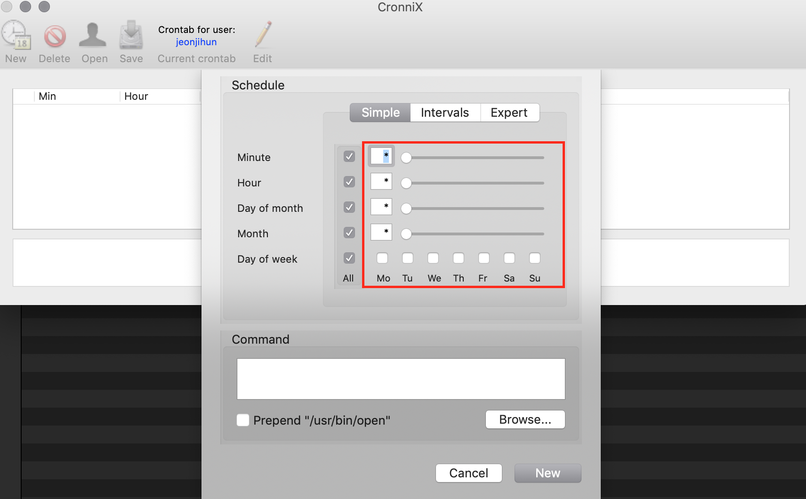
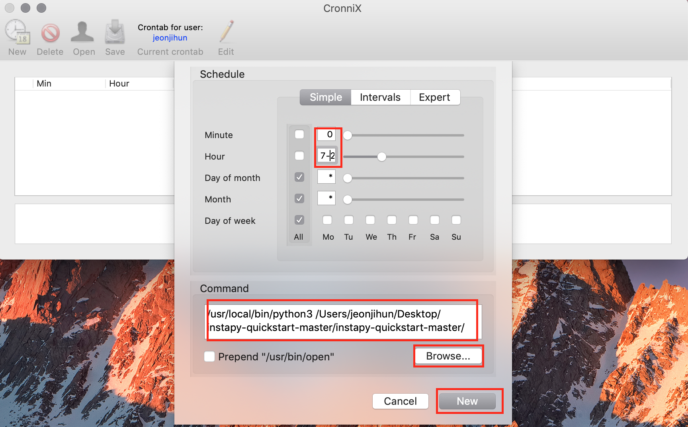
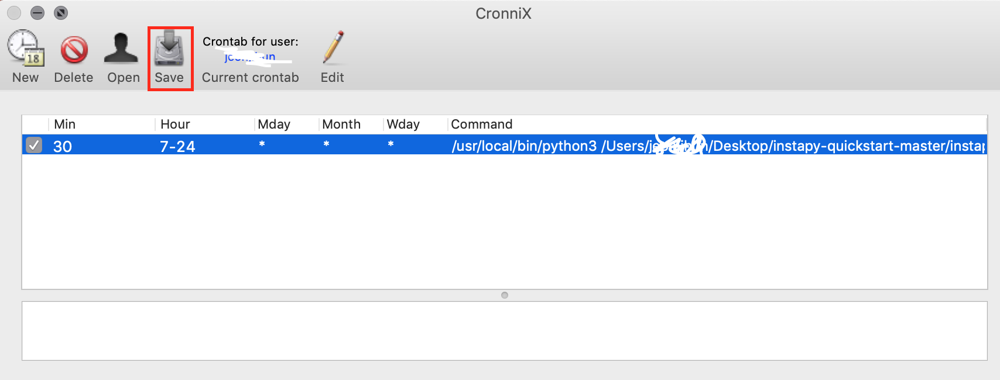
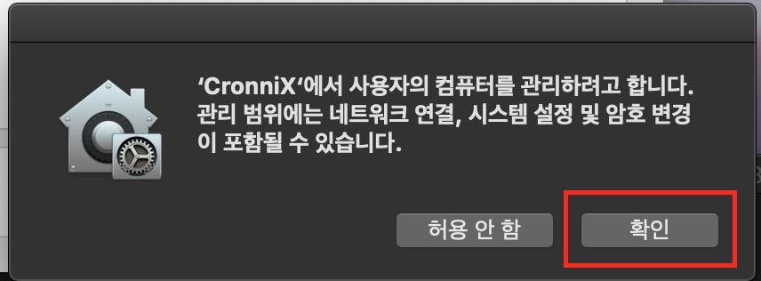

### 스케쥴러(Mac)

특정 시간마다 프로그램을 실행 할수 있게 하는 것을 스케쥴링 이라고 표현 합니다. 
윈도우에서는 작업 스케줄러라고 하여 GUI프로그램을 제공하지만, 맥에서는 따로 설치를 해서 사용해야 하는데 **Cronnix**라는프로그램을 이용해서 해보겠습니다.

Cronnix는 아래 링크를 통해 다운 받으실수 있습니다. 

[Cronnix](https://drive.google.com/file/d/1IMB4iOC7i3yz80SNKnLnGPc3xCZzIR47/view?usp=sharing)

### Cronnix 

Cronnix는 주기적으로 반복해야 하는 프로그램을 실행 시켜주는 프로그램 입니다.

이제 Cronnix를 이용해서 봇을 주기적으로 작동하도록 해보겠습니다.

#### Cronnix 사용하기

1. Cronnix를 키고 New를누릅니다. 


2. New 를 누르면 아래와 같이 나오는데 Simpe탭을 눌러서 이동한후 보면 아래와 같은 화면이 나옵니다.



빨간 상자를 보면 상자 앞에 Minute ,Hour등이 써있고 그다음에 체크 박스가 있습니다. 

여기서 

```
Minute는 분

Hour는 매시간

Day of month 는 매일

Month 는 매달

Day of week 는 특정 주
```

를 의미 합니다.

위와 같이 같이 모두 체크 박스가 되어있는건 **매일 1분마다 실행 하겠다** 라는 의미 입니다. 
또한 *는 매분, 매시간을 의미 합니다. 그래서 모두 체크박스가 되어있는것과 같은 의미가 됩니다.

만약 Minute를 30으로 설정해놓으면 **매일 매시간 30분에 실행 하겠다** 라는 의미를 가집니다.
여기서 Hour를 1로 설정해놓으면 **매일 1시30분에 실행하겠다** 라는 의미 입니다.

우리의 봇은 매일 매시간 동작 해야 하니 **Minute는 30**으로 하고, 시간은 사람이 활동하는 시간 아침 7시부터 오후12시 까지 동작 한다고 가정하여 **Hour는 7-24** 라고 하겠습니다.

 Hour에서 숫자 사이에 -는 시작시간-끝시간으로 해서 시작 시간부터 끝시간 까지 매시간을 의미 합니다. 
이건 Minute에도 유효 한데요 1-30하면 1분 부터 30분까지 매 분을 의미 합니다. 

**(이 규칙은 crontab이라는 스케쥴링 프로그램의 룰을 따르기 때문에 더 궁금한 점은 [링크](https://jdm.kr/blog/2) 를 눌러서 더 찾아보시는걸 추천드립니다.)**

3. 시간을 설정했으면 아래에 Command에 실행 시킬 프로그램을 불러 옵니다. 우리는 like_by_tags.py를 실행 시켜 보겠습니다. Browse..버튼을 눌러서 like_by_tags.py파일을 불러옵니다.

   

   그리고 나서 이 파일을 실행 시킬 python을 불러 와야 하는데요. mac은 기본 python2.7이 설치가 되어있어서 python3를 불러 와야 합니다. 이때 단순히 python3이렇게 해서 불러오는게 아니라 python3의 위치까지 정확히 지정해 줘야 합니다.

   ---

   ##### 3.1 파이썬 위치 알아내기

   

   VSCode 터미널혹은 맥 터미널에서 

   ```
   which python3
   ```

   라고 입력 합니다.

   그러면 위 사진과 같이 명령어 밑에 **/usr/local/bin/python3** 라고 나오는데 이게 python3의 실행파일의 위치 입니다.

   ---

   이제 python3의 실행파일 위치도 알았으니 Command 창 안에 파일 위치 앞에 python3의 위치를 입력해줍니다. 

   ```
   #실행 구조
   /usr/local/bin/python3 실행할파일위치
    
   # 실제 실행 명령어
   /usr/local/bin/python3 /Users/Desktop/instapy-quickstart-master/instapy-quickstart-master/like_by_tags.py
   ```

   위와 같이 입력을 해줍니다. 실행파일 위치의 경우 하시는 분 마다 다를 것입니다.

   모든 설정을 다했으면 "New"버튼을 눌러줍니다.

   

4. 생성이 완료되면 맨처음 프로그램을 켰을때 화면에 우리가한 설정 값이 보일겁니다. 이때 "Save"를 눌러 줍니다. 이건 컴퓨터에 내가한 설정을 적용 시켜주는 작업입니다. 항상 설정하고 나서 "Save"를 눌러주셔야 하고 설정을 지우고 싶을때도 "Delete"를 누른후 "Save"해줘야 반영 됩니다.




5. "Save" 를 누르면 아래와 같은 메시지가 나오는데 확인을 누르면 실제로 반영이 되면서 봇이 작동하게 됩니다.

