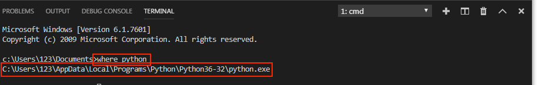
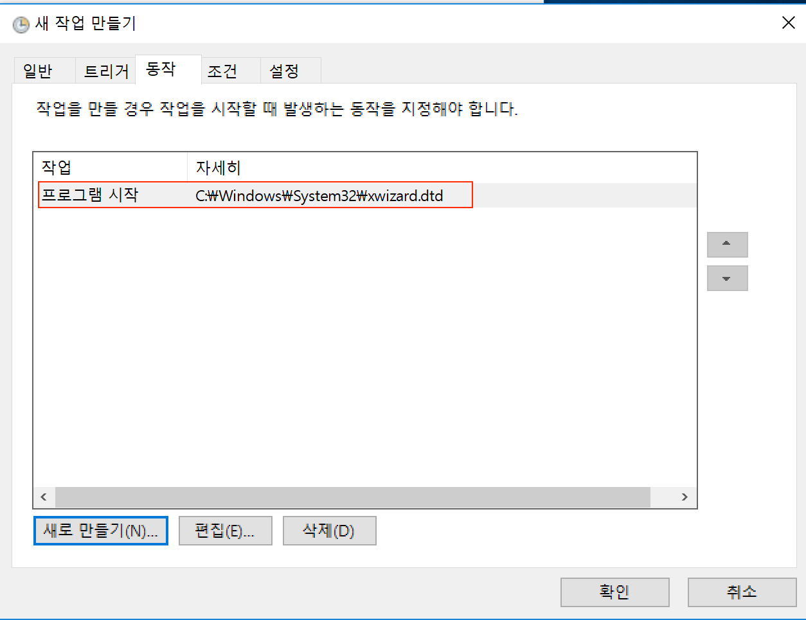

### 스케쥴러(Windows)

특정 시간마다 프로그램을 실행 할수 있게 하는 것을 스케쥴링 이라고 표현 합니다. 
윈도우에서는 작업 스케줄러라고 하여 GUI프로그램을 제공하기 때문에 손쉽게 사용할수 있는데요.


### 작업스케쥴러 사용하기


1. 윈도우로고키+R을 하시면 **실행**이라는 창이 뜨는데 이때 **열기** 에다가 **Taskschd.msc**를 입력하고 확인 버튼을 눌러줍니다.


2. 아래와 같은 창이 뜨는데 이때 **작업 만들기** 를 클릭 합니다.

   


3. 작업만들기가 켜지면 **일반** 탭이 가장 먼저 보이실 텐데 이름과 설명에 '인스타그램봇'이라고 입력해줍니다.


4. 그리고 나서 **트리거** 탭을 누르고 새로만들기를 누릅니다. 트리거는 작업을 어떤 시간과 어떤 주기로 할거냐를 정하는 곳 입니다. 


새 트리거 만들기 창이 뜨면 왼쪽 설정에서 **매일** 을 누러주고 **시작** 에서 일자와 시간을 정해줍니다. 여기서 **시작** 은 프로그램을 반복적으로 돌릴때 최초에 언제 시작하게 할건지를 정하는 것입니다. 

고급설정 에서 **작업 반복 간격** 을 설정해줍니다. 간격은 1시간으로 해주고 매일 동작 시킬것이기 때문에 **기간** 은 무기한으로 해줍니다. 그리고 나서 확인을 눌러줍니다.

**(윈도우의 경우 몇시부터 몇시까지만 동작하게 하는 방법이 존재 하지 않아서 인스타그램봇을 돌리고 싶은 시간만큼 컴퓨터를 켜놓으셨다가 끄시면 됩니다.)**


5. 트리거 설정이 완료 됐으면, **동작** 탭으로 가서 새로 만들기를 합니다. 동작은 실제로 동작 시킬 명령을 지정하는 곳입니다.


6. 동작을 생성하는데 먼저 1번 부분을 보면 저부분은 python을 실행시키는 프로그램을 불러와야 합니다. 우리는 여기서 like_by_tags.py을 실행 시키도록 하겠습니다. 일단 '찾아보기' 버튼을 눌러서 할수도 있지만 그렇게 하면 찾기가 힘듭니다. 그래서 다른 방법을 사용해 보겠습니다.


---

##### 6.1 파이썬 위치 알아내기



VSCode 터미널혹은 맥 터미널에서 

```
where python
```

라고 입력 합니다.

그러면 위 사진과 같이 명령어 밑에 **c:\Users\123\AppData\Local\Programs\Python\Python36-32\python.exe** 라고 나오는데 이게 python3의 실행파일의 위치 입니다.

---

이제 python의 실행파일 위치도 알았으니 **프로그램/스크립트** 에 위에서 알아낸 파이썬의 위치를 넣어줍니다. 

그리고 나서 2번인 **인수추가(옵션)** 에 내가 실행 시키고자 하는 파일의 위치와 함께 입력해줍니다. 
저는 2번에 '/Users/Desktop/instapy-quickstart-master/instapy-quickstart-master/like_by_tags.py'을 넣어주겠습니다. 
이 파일의 위치는 하시는 분 마다 다르므로 파일의 위치를 알고 싶으시면 수업시간에 했던 것 처럼 파일을 VSCode의 터미널에 드래그 해서 위치를 알아내시면 됩니다. 모두 입력후 확인을 누르시고 아래와 같이 나오면 등록이 완료됐습니다.




7. 모든 등록이 끝났으면 확인을 눌러서 **새 작업 만들기** 를 마칩니다. 그리고 나서 아래에 빨간 박스친 부분을 마우스 스크롤을 가장 밑으로 내리면 우리가 만든 작업을 확인 할수 있습니다. 아래 사진과 비슷하게 보인다면 등록에 성공한것 입니다.


