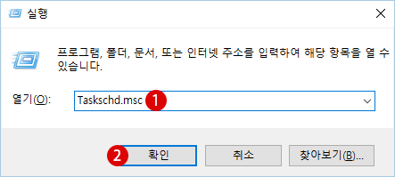
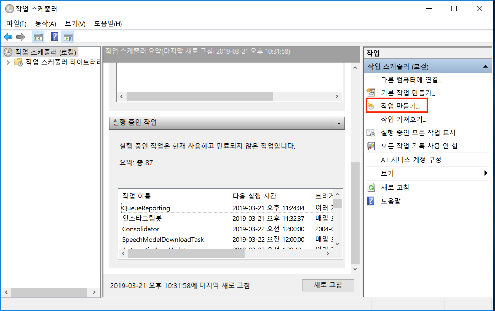
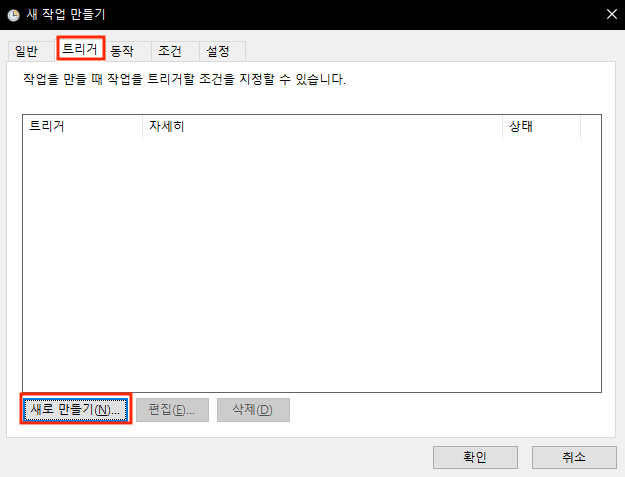
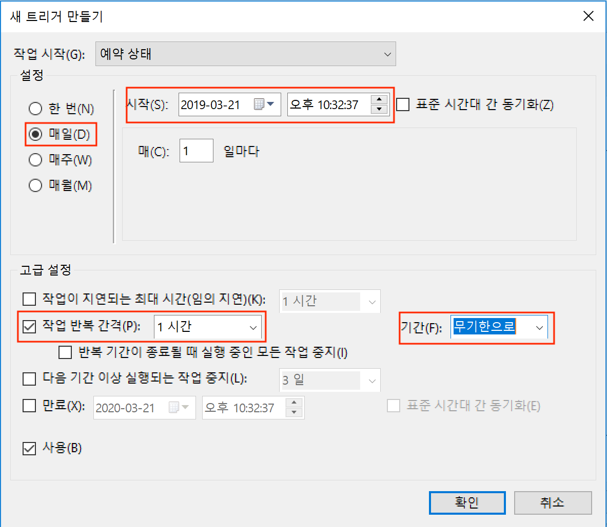

### 스케쥴러(Windows)

특정 시간마다 프로그램을 실행 할수 있게 하는 것을 스케쥴링 이라고 표현 합니다. 
윈도우에서는 작업 스케줄러라고 하여 GUI프로그램을 제공하기 때문에 손쉽게 사용할수 있는데요.

### 작업스케쥴러 사용하기

1. 윈도우로고키+R을 하시면 **실행**이라는 창이 뜨는데 이때 **열기** 에다가 **Taskschd.msc**를 입력하고 확인 버튼을 눌러줍니다.

2. 아래와 같은 창이 뜨는데 이때 **작업 만들기** 를 클릭 합니다.

   

3. 작업만들기가 켜지면 **트리거** 탭을 누르고 새로만들기를 누릅니다. 트리거는 작업을 어떤 시간과 어떤 주기로 할거냐를 정하는 곳 입니다. 새 트리거 만들기 창이 뜨면 왼쪽 설정에서 **매일** 을 누러주고 시작 일자와 시간을 정해줍니다. 

   고급설정 에서 **작업 반복 간격** 을 설정해줍니다. 간격은 1시간으로 해주고 매일 동작 시킬것이기 때문에 **기간** 은 무기한으로 해줍니다. 그리고 나서 확인을 눌러줍니다.

4. 트리거 설정이 완료 되었으면, **동작** 탭으로 가서 새로 만들기를 합니다. 동작은 실제로 동작 시킬 명령을 지정하는 곳입니다.

5. 

